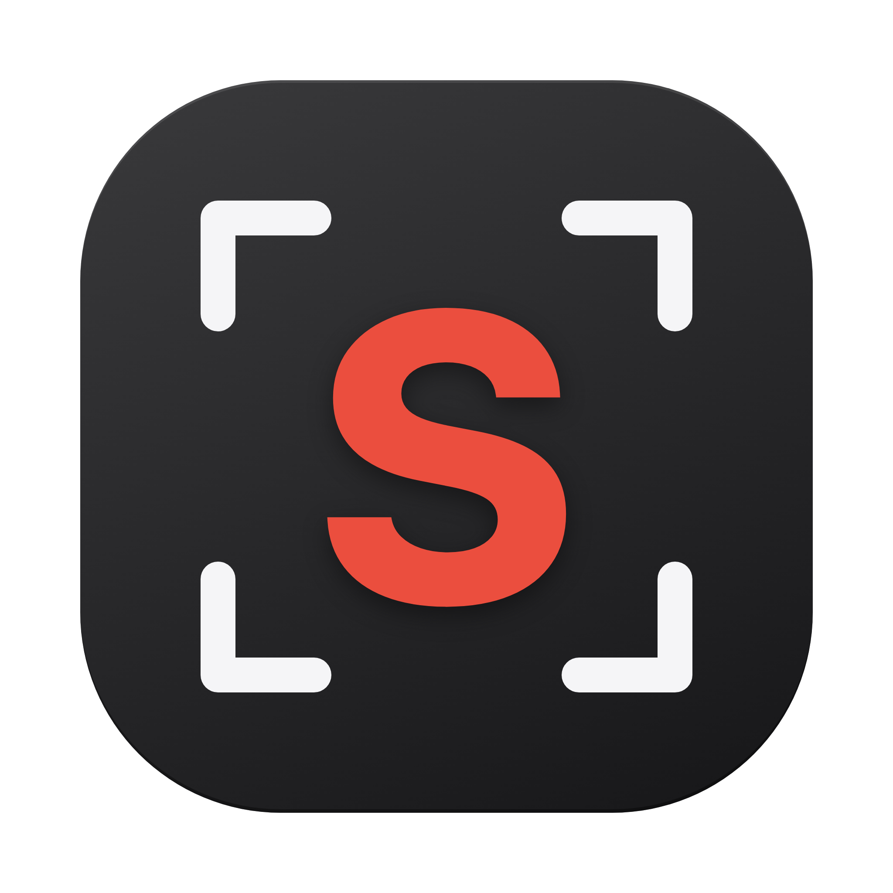

<p align="center">
  
</p>

<h1 align="center">Snap It</h1>

<p align="center">
  A fast, local-only screenshot &amp; screen-recording tool for QA — Lightshot-style capture,
  on-image annotation, and one-key recording, all from the menu bar.
</p>

<p align="center">
  
  
  
  
  
</p>

---

## Demo

<!-- TODO: record a short capture → annotate → copy/record clip (snapit snapping itself!),
     save it as docs/demo.gif, and uncomment:
<p align="center"></p> -->

> 🎬 _A short demo GIF is on the way — snapit, snapping itself._

## What it is

**snapit** is a desktop tray app that lives in your menu bar and gives you three capture modes
behind global hotkeys — plus an editor for images you already have:

- **Screenshot** (`⌘⇧9`) — freeze the screen, drag a resizable selection box, annotate it, then
  copy or save.
- **Record** (`⌘⇧8`) — pick any screen or window, optionally crop to a region, choose 30/60 fps and
  audio, and record to a native `.mp4`.
- **Record GIF** (`⌘⇧7`) — same source/region picker, choose a frame rate, and record a silent
  animated `.gif` (encoded on-device).
- **Open image** — right-click a `PNG` / `JPG` / `WEBP` in Finder → **Open With → snapit** (or use
  the tray's **Open image…**), annotate it with the full toolset, and save a copy or overwrite the
  original.

Everything stays on your machine — captures go to the clipboard or a folder you choose. Nothing is
uploaded anywhere.

## Features

**Screenshot & annotate**

- Freeze-frame capture of the display under the cursor, at native (Retina) resolution.
- A selection box that's a live window into the frozen screen — **movable** and **corner-resizable**.
- Annotation tools: rectangle, ellipse, arrow, line, and pen.
- Color presets plus a custom-color popover; **Cmd+Scroll** adjusts stroke thickness with a live
  size preview.
- Move / select / delete shapes, resize via handles, and full **undo / redo**.
- Output: **Copy** (or `⌘C`), **Save** (timestamped PNG to your folder), or **Save As…** (dialog).

**Screen recording**

- Source picker for any screen or window; full-screen or **region** crop.
- **30 / 60 fps**, with optional system audio and microphone (mixed when both are on).
- Native **`.mp4`** (H.264/AAC) when the runtime supports it, otherwise `.webm`.
- A **draggable Stop pill** floats over the screen; the rest of the overlay is click-through. The
  pill is excluded from the recording itself, so your captures stay clean.

**GIF recording**

- Same source picker (screen / window) and region crop as video, but silent.
- **Frame rate** — 15 / 30 / 60 presets or a custom value (5–60 fps, default 30); frames are captured
  at the area's actual on-screen resolution (not the 2× Retina buffer) and encoded to `.gif`
  on-device with [`gifenc`](https://github.com/mattdesl/gifenc) — no external tools.
- **Per-frame palettes** (each frame gets its own 256 colours → accurate screen colours, no banding)
  plus **inter-frame differencing** (unchanged pixels written transparent) to keep files small.
- Encoded incrementally while recording, so memory stays bounded and playback is real-time.
- The setup panel recommends **recording video instead** for Slack / GitHub / Jira — they autoplay
  video, which is sharper and much smaller than a GIF; one click switches to the video recorder.

**Open & edit an image**

- Edit an image that already exists on disk with the same annotation toolset as screenshots — the
  whole image is the canvas.
- Entry points: **Finder → right-click → Open With → snapit** for `.png` / `.jpg` / `.jpeg` /
  `.webp` (snapit registers as an _editor_, so it never becomes your default image handler), or the
  tray's **Open image…** picker.
- **Save a copy** (default, non-destructive) or **Overwrite original…** (confirmed first); exports at
  the image's native resolution and preserves its format.

**App**

- Background **menu-bar / tray app** (no dock icon) with a branded icon; the image editor is a normal
  window that appears in the Dock / taskbar while open.
- **Settings** window to edit both hotkeys and the save folder, persisted across launches.
- Capture overlays are excluded from screen capture (content-protected) so they never bleed into a
  recording.

## Shortcuts

| Action                           | Shortcut               |
| -------------------------------- | ---------------------- |
| Open screenshot capture          | `⌘⇧9` _(configurable)_ |
| Open recording                   | `⌘⇧8` _(configurable)_ |
| Open GIF recording               | `⌘⇧7` _(configurable)_ |
| Copy annotated image             | `⌘C`                   |
| Undo / Redo                      | `⌘Z` / `⌘⇧Z` (or `⌘Y`) |
| Delete selected shape            | `Delete` / `Backspace` |
| Adjust stroke thickness          | `⌘` + scroll           |
| Dismiss overlay / stop recording | `Esc`                  |

> Hotkeys use `Ctrl` instead of `⌘` on Windows and Linux.

## Install

Grab the latest build for your OS and run it:

| OS                       | File                                     | Notes                                             |
| ------------------------ | ---------------------------------------- | ------------------------------------------------- |
| macOS                    | `snapit-<version>-mac-<arch>.dmg`        | Open the `.dmg`, drag **snapit** to Applications. |
| Windows _(experimental)_ | `snapit-<version>-win-<arch>-setup.exe`  | Run the installer (NSIS).                         |
| Linux _(experimental)_   | `snapit-<version>-linux-<arch>.AppImage` | `chmod +x` and run.                               |

> **Platform support:** snapit is developed and tested on **macOS**. The Windows and Linux builds are
> produced by CI and are **experimental — not yet verified on real hardware**. They should work
> (standard Electron APIs), but expect rough edges, especially on **Linux/Wayland**, where screen
> capture goes through the PipeWire portal and the capture overlay can't be hidden from recordings.
> Unsigned-app warnings also apply (Windows SmartScreen → _More info → Run anyway_; Linux may need
> `libfuse2`). Bug reports from these platforms are welcome.

> **Linux "Open With":** a bare `.AppImage` doesn't register its file associations until it's
> integrated into the desktop (e.g. via [`appimaged`](https://github.com/probonopd/go-appimage) or
> AppImageLauncher). Until then, **Open With → snapit** won't appear in your file manager — use the
> tray's **Open image…** instead, which works everywhere. macOS and Windows register the association
> automatically on install.

<details>
<summary><strong>macOS first-launch notes</strong> (Gatekeeper + Screen Recording)</summary>

snapit is signed with an ad-hoc signature but **not notarized** (notarization requires a paid Apple
Developer account). So macOS blocks the first launch with _"snapit is damaged"_ or _"Apple could not
verify… malware"_. The app is safe — macOS distrusts anything not notarized through the paid program.

- **Open it (easiest):** clear the download quarantine flag, then launch normally:
  ```bash
  xattr -dr com.apple.quarantine /Applications/snapit.app
  ```
- **Or via the UI:** **System Settings → Privacy & Security**, find the "snapit was blocked" notice →
  **Open Anyway**. (Right-click → **Open** also works on some macOS versions.)
- **Screen Recording permission:** grant it to snapit (System Settings → Privacy & Security →
  Screen Recording) on first capture, or frames come back black.
- **Permissions re-prompt after a reinstall/update:** builds are ad-hoc signed, so each new build
  can look like a different app to macOS and Privacy grants (Screen Recording / Microphone) reset.
  If capture stops working or you get stuck prompts, clear snapit's grants and re-grant on next
  launch:
  ```bash
  tccutil reset All com.karantrehan.snapit
  ```
  Then quit and relaunch snapit. _(This goes away once builds are signed with a stable identity.)_

</details>

## Develop

Requires **Node 22** (pinned via Volta).

```bash
npm install
npm run dev          # launch the app (tray + global hotkeys)
npm run typecheck    # type-check main, preload, and renderer
npm run build        # bundle main / preload / renderer into out/
npm run format       # prettier --write .
npm run icon         # regenerate the app + tray icons
```

Run from a terminal that has been granted **Screen Recording** permission (the permission belongs
to the launching process).

## Build installers

The icons live in `build/`; output lands in `dist/`.

```bash
npm run dist:mac     # → dist/snapit-<version>-mac-<arch>.dmg
npm run dist:win     # → dist/snapit-<version>-win-<arch>-setup.exe  (build on Windows)
npm run dist:linux   # → dist/snapit-<version>-linux-<arch>.AppImage
```

Packaging is handled by [`electron-builder`](https://www.electron.build/) via
[`electron-builder.yml`](electron-builder.yml). Each target is best built on its own OS.

### Releases

Pushing a version tag builds all three installers on their native runners and publishes them to the
matching GitHub Release, with notes pulled from [`CHANGELOG.md`](CHANGELOG.md)
([`.github/workflows/release.yml`](.github/workflows/release.yml)):

```bash
# 1. add a "## [x.y.z]" section to CHANGELOG.md, then:
git tag vX.Y.Z
git push --tags
```

## Tech stack

Electron 42 · TypeScript · electron-vite · React 19 · Konva 10. The renderer is **feature-based**
(`src/renderer/src/features/{screenshot,record,gif,settings}/`), with the Electron main process in
`src/main/`. See [`docs/STATUS.md`](docs/STATUS.md) and [`docs/DESIGN.md`](docs/DESIGN.md) for the
handoff notes and the longer-term roadmap.

## Declaration

snapit is an **independent, personal project**. It is **local-only**: screenshots and recordings
are written to your clipboard or a folder you choose, and the app makes no network calls and sends
no telemetry. It is provided **as-is**, with no warranty, under the MIT License.

## License

[MIT](LICENSE) © 2026 Karan Trehan
